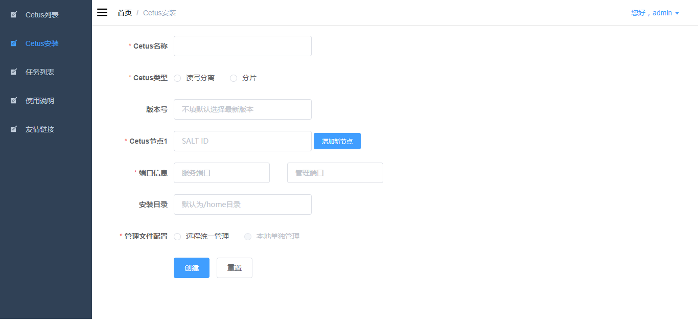
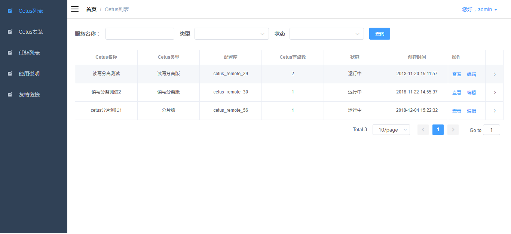
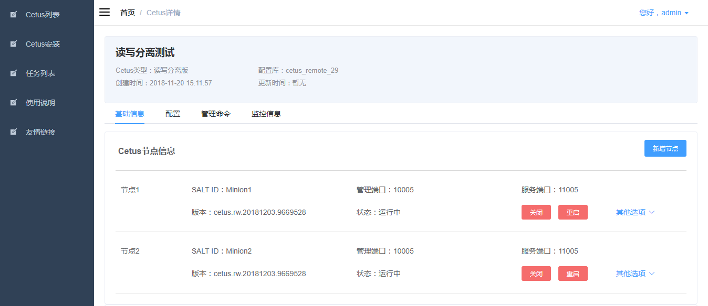
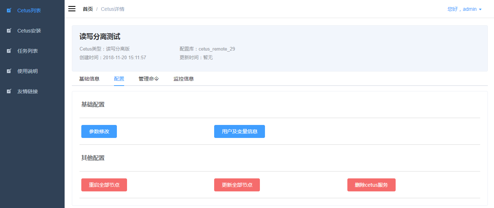
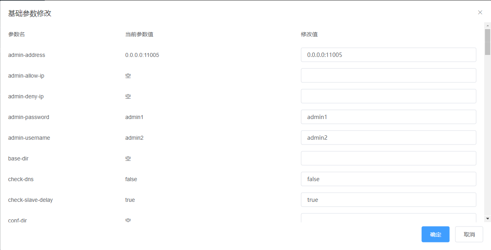
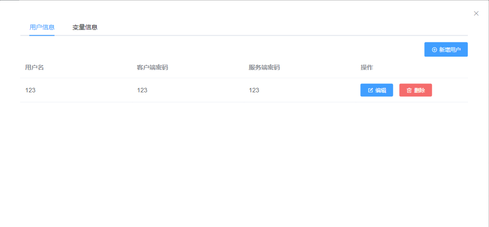
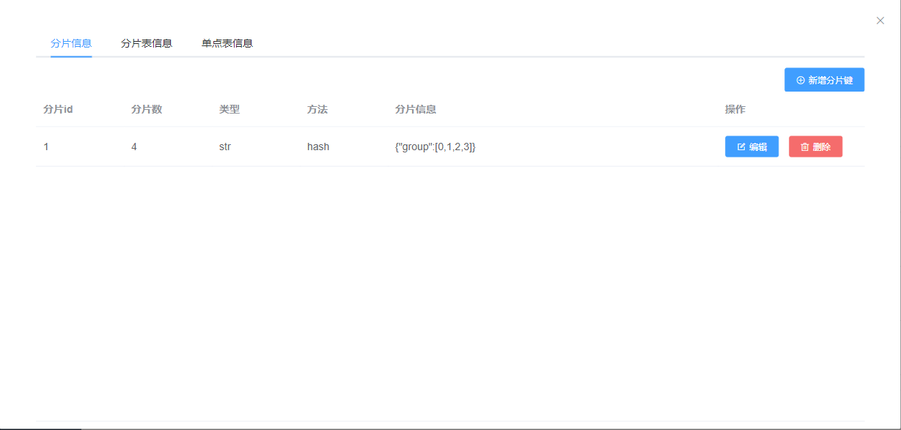
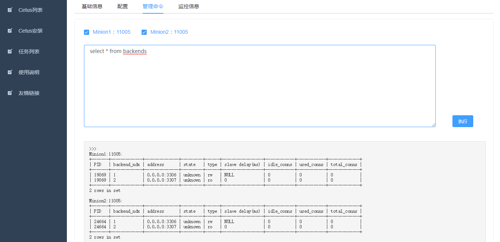
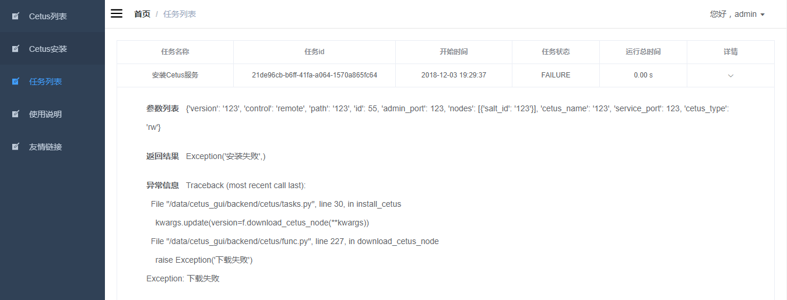

## Cetus-GUI

---

Cetus-GUI是基于web端的Cetus集群可视化管理系统，能有效的提升部署与管理Cetus集群的效率。

**本项目当前仅适用于SaltStack环境下使用远程配置库安装配置多Cetus节点的需求。**

---

### 环境需求

---

环境要求：SaltStack Latest

---

### 安装

---

**阅读 [help](./frontend/docs/HELP.md) 文档配置安装。**

目前项目支持docker安装与源码安装两种方式，推荐使用docker安装。

---

### 使用说明

---

* 登陆

    * 项目启动后，直接访问http://localhost:9527(docker安装), http://localhost:9528(源码安装)登陆系统。
    * 默认用户名与密码为admin/admin，可在Django端新增用户。
    
* 安装Cetus

    
    
    可以在SaltStack环境下的Minion节点安装Cetus，通过安装多节点可以配置Cetus端的负载均衡。
    
    提交安装请求后，若安装失败将在任务列表中显示对应log信息。
    
* Cetus列表

    
    
    显示所有Cetus运行或安装中的状态，点击查看可以查看Cetus详细信息，点击编辑可以修改Cetus基本信息。

* Cetus详情

    
    
    支持Cetus信息状态查询，节点的启动、关闭、更新、删除、新增等操作。

* Cetus配置

    
    
    支持Cetus基础参数的修改，用户与变量信息修改，分片信息修改，重启、更新、删除全部节点等功能。
    
    * 基础参数修改
    
        
        
        注意字体加粗的为静态参数，需要手动重启Cetus客户端才能生效。
    
    * 用户和变量信息修改
    
        
        
        其中用户名在Cetus端和MySQL端是一致的。密码分为客户端密码和服务端密码两种。
        客户端密码为客户端连接Cetus时的密码，服务端密码为Cetus端连接数据库的密码，两者可以不同。
        新增用户后也需要重启Cetus客户端来使信息生效。
        
    * 分片信息修改
    
        
        
        分片信息可在Cetus为分片版本时修改，具体的配置方式请参考https://github.com/Lede-Inc/cetus/blob/master/doc/cetus-shard-profile.md。
        
* Cetus管理命令

    
    
    支持直接在web端执行命令发送到Cetus管理端。
    
    具体支持的命令请参考：
    
    * 读写分离版：https://github.com/Lede-Inc/cetus/blob/master/doc/cetus-rw-admin.md
    * 分片版：https://github.com/Lede-Inc/cetus/blob/master/doc/cetus-shard-admin.md

* Cetus监控

    
    
    Cetus在默认安装完成后会自动部署脚本，每分钟收集一次监控信息。系统默认收集了backends信息，连接数信息，TPS/QPS信息等内容。

* 任务执行查询

    由于Master与Minion节点系统环境的不确定性，安装Cetus时会因各种情况报错，我们可以在任务列表中查看失败的任务。

    
    
    我们也可以直接查询应用日志定位问题，如果日志中的信息无法帮你准备定位并解决问题，请联系我们。
    
---

### TODO

---

```
本地Cetus监控
```

